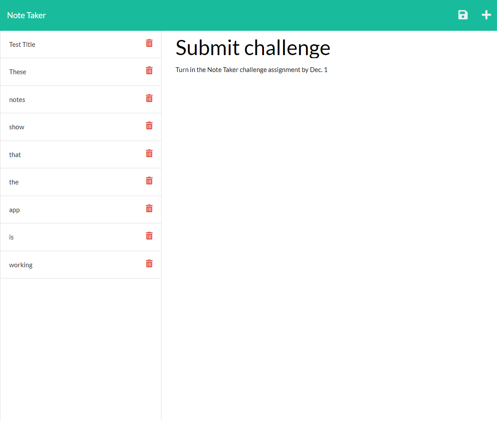

# note-taker-challenge

## Description

This challenge is designed to take our newfound knowledge of Express.js and use it to create an application that allows the user to make and save notes for themselves.

## Installation

This project uses Node.js v.16.18.0 and Express.js.

## Usage

When the user opens the application, they can click on the link to the notes page. There they will find a saved notes column on the left, and a form to add a new note on the right. When they enter a note title and text, there is a save button that will save the note to the column on the left. For me, the new note did not appear on the left until after I had refreshed the page once. After the first refresh, new notes appeared on the left when added, without having to refresh the page again. When the user clicks on a note on the left, it will be displayed on the right. The user can then click on the plus icon in the upper right corner to create a new note. The notes currently cannot be deleted by clicking on the trash icon.

This is the notes page: 

The application can be accessed at [https://evening-shelf-91169.herokuapp.com/](https://evening-shelf-91169.herokuapp.com/).

## Credits

I closely followed the examples given in the coursework.

## License

None
